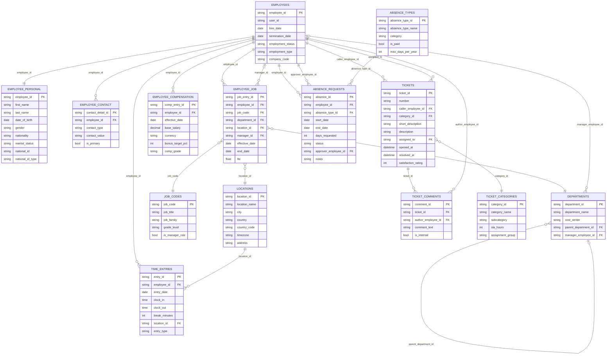
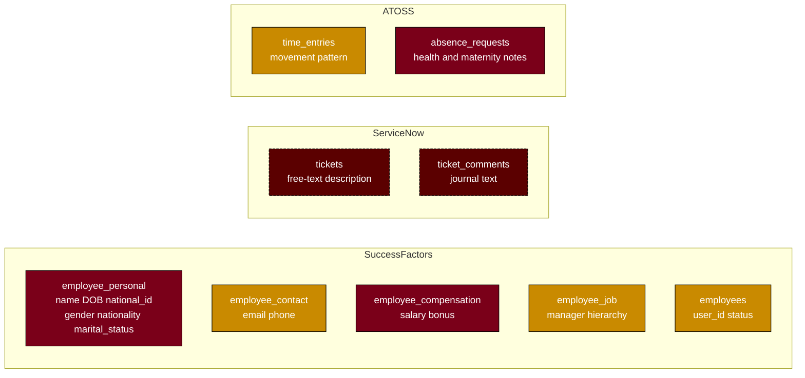

# Source Data Analysis — SuccessFactors / ServiceNow / ATOSS

A unified inspection of the 14 CSV files under `data/` covering: cross-system relationships, foreign keys, PII classification, and data quality findings.

---

## 1. Cross-System Identifier Map

| Identifier | Owning System | Re-used in | Notes |
|---|---|---|---|
| `employee_id` (EMP###) | SuccessFactors (`employees`) | ServiceNow (`tickets.caller_employee_id`, `tickets.assigned_to`, `ticket_comments.author_employee_id`), ATOSS (`time_entries`, `absence_requests.employee_id`, `absence_requests.approver_employee_id`) | The **canonical join key** across all three systems. |
| `location_id` (LOC##) | SuccessFactors (`locations`) | ATOSS (`time_entries.location_id`) | Shared site code. Not used by ServiceNow. |
| `user_id` (e.g. `amueller`) | SuccessFactors (`employees`) | None directly, but matches the local-part convention of `@sonova.com` emails in `employee_contact` | Useful as a soft join to email/SSO logs. |

> No system uses surrogate keys other than its own row identifiers — `employee_id` is the only stable cross-system anchor.

---

## 2. Entity Relationship Diagram

PII-bearing tables and attributes are highlighted by category in the **PII summary diagram** further below. The ER diagram here focuses on schema and relationships; the column-level PII classification is in Section 3.

### Foreign-key inventory (declared & inferred)

| From (table.column) | → To (table.column) | Type | Cardinality |
|---|---|---|---|
| `employee_personal.employee_id` | `employees.employee_id` | Within-system | 1:1 |
| `employee_contact.employee_id` | `employees.employee_id` | Within-system | N:1 |
| `employee_job.employee_id` | `employees.employee_id` | Within-system | N:1 |
| `employee_job.job_code` | `job_codes.job_code` | Within-system | N:1 |
| `employee_job.department_id` | `departments.department_id` | Within-system | N:1 |
| `employee_job.location_id` | `locations.location_id` | Within-system | N:1 |
| `employee_job.manager_id` | `employees.employee_id` | Self-referential | N:1 |
| `employee_compensation.employee_id` | `employees.employee_id` | Within-system | N:1 |
| `departments.parent_department_id` | `departments.department_id` | Self-referential | N:1 |
| `departments.manager_employee_id` | `employees.employee_id` | Within-system | N:1 |
| `tickets.caller_employee_id` | `employees.employee_id` | **Cross-system → SF** | N:1 |
| `tickets.assigned_to` | `employees.employee_id` | **Cross-system → SF** | N:1 |
| `tickets.category_id` | `ticket_categories.category_id` | Within-system | N:1 |
| `ticket_comments.ticket_id` | `tickets.ticket_id` | Within-system | N:1 |
| `ticket_comments.author_employee_id` | `employees.employee_id` | **Cross-system → SF** | N:1 |
| `time_entries.employee_id` | `employees.employee_id` | **Cross-system → SF** | N:1 |
| `time_entries.location_id` | `locations.location_id` | **Cross-system → SF** | N:1 |
| `absence_requests.employee_id` | `employees.employee_id` | **Cross-system → SF** | N:1 |
| `absence_requests.approver_employee_id` | `employees.employee_id` | **Cross-system → SF** | N:1 |
| `absence_requests.absence_type_id` | `absence_types.absence_type_id` | Within-system | N:1 |

---

## 3. PII Inventory & Classification

GDPR-relevant categorisation for downstream masking, access control, and retention rules.

### Direct identifiers — **PII-S (sensitive / restricted)**

| Field | Table | Why |
|---|---|---|
| `national_id` + `national_id_type` | `successfactors/employee_personal` | AHV, INSEE, NINO, Aadhaar, DNI, Codice Fiscale, etc. Strongest direct identifier. |
| `base_salary`, `bonus_target_pct`, `comp_grade` | `successfactors/employee_compensation` | Personal financial data. Subject to local employment-law confidentiality (e.g. Swiss DSG, German BDSG). |

### Direct identifiers — **PII (standard)**

| Field | Table |
|---|---|
| `first_name`, `last_name` | `employee_personal` |
| `date_of_birth` | `employee_personal` |
| `contact_value` (where `contact_type=Email` / `Phone`) | `employee_contact` |
| `address`, `country`, `city` | `locations` (low-risk on its own; combined with employee → home/work site) |
| `user_id` | `employees` (login handle, indirect identifier) |

### Special category — **PII-SC (GDPR Art. 9 / equivalents)**

| Field | Table | Reason |
|---|---|---|
| `gender` | `employee_personal` | Sensitive in some jurisdictions. |
| `nationality` | `employee_personal` | Often treated as ethnic-origin proxy. |
| `marital_status` | `employee_personal` | Family status — restricted under various local laws. |
| `absence_type_id` (when = AT02 Sick / AT04 Maternity / AT05 Paternity / AT08 Compassionate) | `absence_requests` | Reveals **health & family** information. |
| `notes` on absence requests | `absence_requests` | Free-text often contains medical reasons (`"Flu"`, `"Medical procedure + recovery"`, `"Maternity leave"`). |

### Indirect / derived identifiers

| Field | Table |
|---|---|
| `employee_id`, `manager_id`, `caller_employee_id`, `author_employee_id`, `approver_employee_id` | All systems |
| `cost_center` | `departments` |
| `entry_date` + `clock_in`/`clock_out` + `location_id` | `time_entries` (movement-pattern leak) |

### Free-text PII leak risk — **highest control priority**

ServiceNow descriptions and journal entries contain PII pasted into free-text fields. Concrete leaks already present in the dataset:

| Source | Leak |
|---|---|
| `tickets.description` TKT016 | AHV number `756.1234.5678.90` |
| `tickets.description` TKT017 | UK NI number `AB 99 88 77 F` (partner / third party) |
| `tickets.description` TKT024 | Insurance card `INS-2024-88432` |
| `ticket_comments.comment_text` CMT007 | Personal email `carlos.garcia.priv@gmail.com` |
| `ticket_comments.comment_text` CMT009 | Newborn name + DOB + French SSN `1 24 03 75 012 345 67` (third-party minor!) |
| `ticket_comments.comment_text` CMT018 | Bank account `Mizuho 1234-5678901` |
| `ticket_comments.comment_text` CMT019 | AHV repeated |
| `ticket_comments.comment_text` CMT020 | Partner NI |
| `ticket_comments.comment_text` CMT026 | Home address `Via Roma 7 Milan 20121` |
| `absence_requests.notes` ABS003, ABS008 | Health condition (`Flu`, `Medical procedure + recovery`) |

> **Recommendation:** route every free-text column through a PII redaction pass (regex + NER) before landing in the analytics warehouse. Treat `tickets.description`, `ticket_comments.comment_text`, and `absence_requests.notes` as PII-S by default.

### PII summary — quick view

Legend: dark red = PII-S/SC restricted • orange = standard PII • dashed red = unstructured PII-leak risk.

---

## 4. Data Quality & Inconsistencies

### 4.1 Referential integrity violations

| # | Issue | Location | Detail |
|---|---|---|---|
| 1 | Orphan `manager_id` | `employee_job` JOB027 | `manager_id=EMP999` does not exist in `employees`. |
| 2 | Orphan `manager_employee_id` | `departments` D09 | `EMP999` does not exist. |
| 3 | Orphan `parent_department_id` | `departments` D10 | `parent_department_id=D99` does not exist. |
| 4 | Orphan `caller_employee_id` | `tickets` TKT013 | Caller `EMP999` not in `employees`. |
| 5 | Orphan `ticket_id` | `ticket_comments` CMT025 | References `TKT999` (does not exist). Comment text even admits this. |
| 6 | Orphan `absence_type_id` | `absence_requests` ABS022 | `AT99` not in `absence_types`. |
| 7 | Ghost `employee_id` | `employee_personal` `EMP888` | "Ghost Record" with no row in `employees`. |

### 4.2 Primary-key / duplicate violations

| # | Issue | Location |
|---|---|---|
| 8 | Duplicate PK `EMP003` | `employees.csv` line 28 (`mrossi2`) — same `employee_id`, different `user_id`. |
| 9 | Duplicate ticket | `tickets.csv` TKT019 is a byte-for-byte copy of TKT001 (also confirmed by CMT021 "duplicate of TKT001"). |
| 10 | Duplicate contacts | `employee_contact.csv` CON052/CON053 duplicate CON002/CON003 for EMP001 (different surrogate IDs, identical content + `is_primary=true`). |
| 11 | Duplicate time entry | `time_entries.csv` TE049 is identical to TE001 (EMP001, 2024-11-04, 08:00–17:15). |

### 4.3 Domain / value violations

| # | Issue | Location | Detail |
|---|---|---|---|
| 12 | Future `hire_date` | `employees` EMP023 | `2099-01-01` — test data not removed. |
| 13 | Future `date_of_birth` | `employee_personal` EMP009 (Priya Sharma) | `2095-01-15` — likely typo for `1995-01-15`. |
| 14 | Implausible `date_of_birth` | `employee_personal` EMP888 | `1900-01-01` (ghost record). |
| 15 | Negative salary | `employee_compensation` COMP028 EMP025 | `-1500.00` INR. |
| 16 | Zero salary | `employee_compensation` COMP026 EMP023 | `0.00` (test record). |
| 17 | Invalid email | `employee_contact` CON054 EMP009 | `not-a-valid-email`. |
| 18 | Invalid / blank phone | `employee_contact` CON017 EMP008 (`INVALID_NUMBER`), CON011 EMP005 (empty), CON047 EMP023 (`+00 000 0000000`). |
| 19 | Inverted absence range | `absence_requests` ABS021 EMP025 | `start_date=2025-03-10`, `end_date=2025-02-28`, `days_requested=-5`. |
| 20 | Clock-out before clock-in | `time_entries` TE046 EMP008 (17:00→08:30), TE051 EMP007 (08:30→02:00). Either overnight shifts (no overnight flag in schema) or data-entry errors. |
| 21 | Inconsistent gender encoding | `employee_personal` | Mixed `M` / `Male` / `male` / `Female` / `Other` / blank. |
| 22 | Blank required-ish fields | `employee_personal` EMP007 (`marital_status`), EMP012 (`gender`), EMP020 (`marital_status`), EMP888 (`nationality`). |
| 23 | Test/sentinel rows | EMP023 (`test.user`, `company_code=9999`, `nationality=Testlandian`, `national_id_type=TEST`), EMP888 ghost, JC14 empty title, D99/EMP999 sentinels. |
| 24 | Empty job code attributes | `job_codes` JC14 — title and grade missing. |
| 25 | Empty location attributes | `locations` LOC07 (`Remote - DACH`) — no city/country/timezone but still referenced (JOB027, JOB030). |
| 26 | Closed but referenced location | `locations` LOC06 Singapore is `Closed`. Not currently referenced — fine, but flag for retention. |

### 4.4 Logical / temporal inconsistencies

| # | Issue | Detail |
|---|---|---|
| 27 | Status vs termination | `employees` EMP017 has `termination_date=2024-06-30` but `employment_status='Active'`. Should be `Terminated`. (EMP021 is correctly `Terminated`.) |
| 28 | Overlapping job entries | `employee_job` EMP019: JOB022 ends 2023-08-31; JOB023 starts 2023-06-01 (3-month overlap); JOB030 starts 2023-07-15 — three records concurrent. |
| 29 | Job entry without proper close | JOB005 EMP003 has `reason='Promotion'` but no prior open record was closed cleanly. |
| 30 | Absence type vs duration | ABS010 EMP013 maternity leave 2024-09-01 → 2025-01-31 = 153 days, but `days_requested=105`. (Calendar vs working-day mismatch — needs documentation.) |
| 31 | Approver = self | None observed currently, but no constraint exists; worth a check at load. |
| 32 | TKT023 references ATOSS hours that don't reconcile | Comment CMT023 reports `2024-09-05 (3h)`, but TE016 for the same date logs 08:00→20:00 (~11h). User self-report disagrees with ATOSS log. |
| 33 | Open ticket with no assignee | TKT023 `assigned_to` is empty. |
| 34 | EMP019 transfer reason | JOB023 reason = `Role Change`, JOB030 reason = `Transfer` — semantic overlap; needs business-rule clarification. |
| 35 | Inactive department referenced | D09 `Legacy IT` is `Inactive` but is the assigned department of JOB027 (EMP023, the test user). Acceptable only because EMP023 itself is junk. |

### 4.5 Cross-system reconciliation gaps

| # | Issue |
|---|---|
| 36 | `EMP021` (Niklas Bauer) is `Terminated` 2024-03-31, yet TE047 logs a time entry on `2024-11-04` — clock-ins after termination. |
| 37 | `EMP017` (Elena Popov) terminated 2024-06-30, yet TE048 logs `2024-11-04` time entry — same issue. |
| 38 | `EMP023` (test user) has tickets? No — but it has compensation, job, contact, personal records — full lifecycle of test data leaked into prod. |
| 39 | `tickets.assigned_to` uses `employee_id` directly, but ServiceNow typically uses sys_user IDs — confirm whether this is already a mapped field or raw EMP-ID (no separate mapping table is provided, so assumed pre-mapped). |
| 40 | Currency consistency: salaries are stored in 5 currencies (CHF, EUR, GBP, JPY, INR) without an FX-rate table — analytics will need a date-keyed FX feed. |
| 41 | Time-zone for `clock_in/clock_out` is implicit from `location_id`, but LOC07 has no timezone — entries TE??? for remote DACH staff cannot be correctly localised. |

---

## 5. Suggested Treatment in the ETL

1. **Standardise** gender → controlled vocabulary (`F`/`M`/`X`/`Unknown`); coerce blank → `Unknown`.
2. **Resolve** `employment_status` against `termination_date` (any past `termination_date` → `Terminated`).
3. **Mask / tokenise** the PII-S columns (`national_id`, `base_salary`, free-text `description` / `comment_text` / `notes`) in silver layer; only the curated marts should hold pseudonymised salary bands and redacted text.
4. **Separate access** over objects in golden layer by creating a shared namespace/folder and different namespaces/folders for each access role. Each role should only have access to it's folder + shared.
